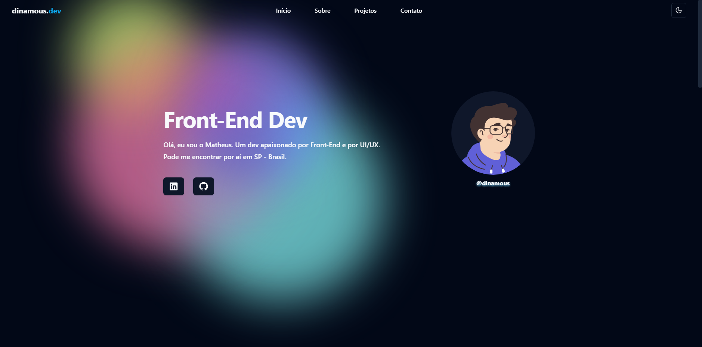

<h1 align="center">
  💻 Portifolio - Dinamous
</h1>

<h4 align="center"><a href="dinamousdev.vercel.app">Clique para visitar o projeto</a></h4>

## 📚 Seções

O site é composto por seis seções:

- **Início:** Nele temos uma breve apresentação;
- **Sobre:** Nessa seção tenho uma descrição dizendo um pouco sobre quem sou;
<!-- - **Experiências:** Abordo algumas empresas da qual prestei meus serviços na área de desenvolvimento e design; -->
- **Projetos:** Apresenta alguns projetos desenvolvidos e com link direto para os respectivos códigos no GitHub;
<!-- - **Serviços:** Exibe através de cards os diferentes serviços em que possuo conhecimentos; -->
<!-- - **Conhecimentos:** Nele apresentamos meus conhecimentos em algumas linguagens como o foco no front-end; -->
- **Contato:** Meus meus meios de contato caso precise me encontrar;
---

## 💼 Tecnologias utilizadas

Para o desenvolvimento deste site utilizei as seguintes tecnologias:

- React.js;
- Tailwind;
- TypeScript;
- Radix/ui;
- Shadcn;

---

<h2>👾 Autor</h2>

<table>
  <tr>
    <td align="center">
      <a href="https://github.com/dinamous">
         
        
          <b>Matheus Simões</b>
        
      </a>
    </td>
  </tr>
</table>